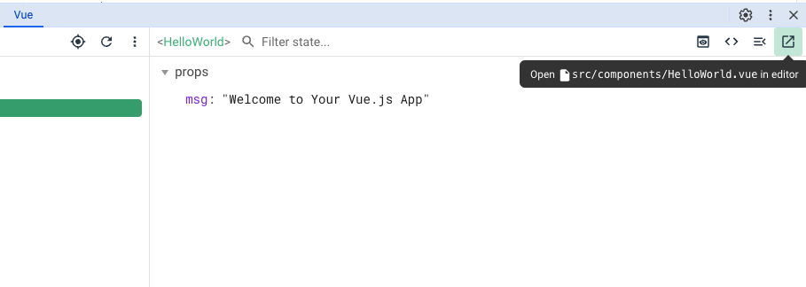
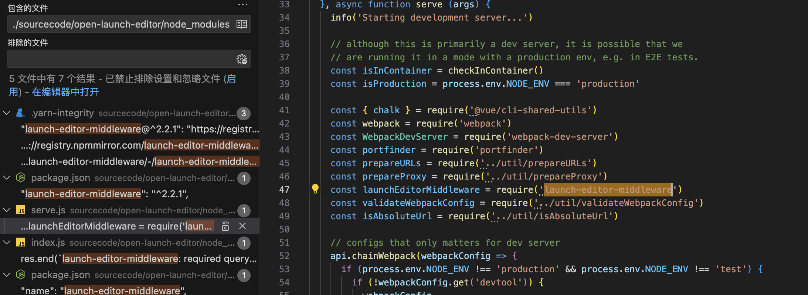
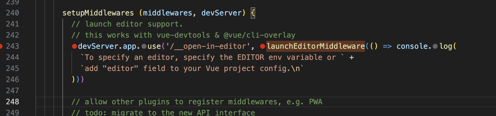
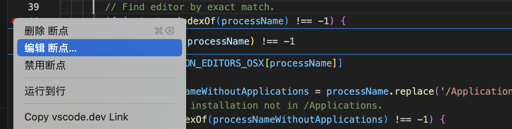
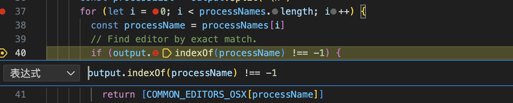

# vue-devtools打开对应文件

## 功能描述
在 vue-devtools 中点击图中的按钮，会唤起编辑器，并打开对应的文件。这是怎么做到的呢？



## 环境准备

我们用vue-cli创建一个项目，`vue create open-launch-editor` 并安装依赖。

通过 `vscode`打开项目的 package.json，并在`scripts`点击 `debug`按钮，进入调试模式运行指令。我们运行 serve 指令，启动对应服务后，可以通过浏览器访问到该项目。

在项目的 `node_modules` 目录下，搜 `launch-editor-middleware`, 可以发现该中间件在 `server.js`中引入并使用。我们在对应的地方打上断点。




## 代码分析
```js
const launchEditorMiddleware = require('launch-editor-middleware')
...
devServer.app.use('/__open-in-editor', launchEditorMiddleware(() => console.log(
    `To specify an editor, specify the EDITOR env variable or ` +
    `add "editor" field to your Vue project config.\n`
)))
```

对`__open-in-editor`使用 launchEditorMiddleware函数返回的中间件。

### launchEditorMiddleware
```js
module.exports = (specifiedEditor, srcRoot, onErrorCallback) => {
  ...

  return function launchEditorMiddleware (req, res, next) {
    const { file } = url.parse(req.url, true).query || {}
    if (!file) {
      res.statusCode = 500
      res.end(`launch-editor-middleware: required query param "file" is missing.`)
    } else {
      launch(path.resolve(srcRoot, file), specifiedEditor, onErrorCallback)
      res.end()
    }
  }
}
```
launchEditorMiddleware 通过 req.url 获取 file的 query 参数，对这个 file 参数进行处理。

当我们点击 vue-devtools里的打开编辑器按钮时，浏览器会发起一个`__open-in-editor`请求。参数是当前的 vue 在项目中的相对文件路径，如
`http://localhost:8080/__open-in-editor?file=src/components/HelloWorld.vue`。 当我们的中间件获取到这个请求，并拿到 file 参数，进入`launch`函数中进行处理。

### launch
```js
// launchEditor 就是 launch 函数
function launchEditor (file, specifiedEditor, onErrorCallback) {
    // file 在launchEditorMiddleware中进行了处理，这里变成了绝对路径
    const parsed = parseFile(file) // 对 file 进行解析，拿到 fileName, lineNumber, columnNumber参数

    const [editor, ...args] = guessEditor(specifiedEditor) // guessEditor作用是猜测使用的是哪个编辑器
}
```

### guessEditor
```js
function guessEditor (specifiedEditor) {
  if (specifiedEditor) {
    return shellQuote.parse(specifiedEditor)
  }

  if (process.env.LAUNCH_EDITOR) {
    return [process.env.LAUNCH_EDITOR]
  }

  if (process.versions.webcontainer) {
    return [process.env.EDITOR || 'code']
  }

  if (process.platform === 'darwin') {
      const output = childProcess
        .execSync('ps x -o comm=', {
          stdio: ['pipe', 'pipe', 'ignore']
        })
        .toString()
      const processNames = Object.keys(COMMON_EDITORS_OSX) // 编辑器列表
      const processList = output.split('\n')
      for (let i = 0; i < processNames.length; i++) { // 遍历所有的编辑器，判断是否有运行在进程中的
        const processName = processNames[i]
        // Find editor by exact match.
        if (output.indexOf(processName) !== -1) {
          return [COMMON_EDITORS_OSX[processName]]
        }
      }
  }
}
```
如果制定了编辑器，那直接返回编辑器。如果没有，则根据 process.platform 判断当前是什么系统。macOS 和 Linux 用 ps x 命令
windows 则用 Get-Process 命令获取当前的进程，和列出的大量编辑器进行比较。

因为这里是个遍历，调试到这个里，每个循环都进去很费时间。这里可以用 vscode 的条件断点。在这行打一个断点，右击断点，点击编辑断点。输入一个条件后，继续调试。当这个条件满足后，会自动在这个断点停下。

]

]

### childProcess.spawn
```js
// 这里的 editor 是  guess 返回的指令。 vscode 会返回 code
_childProcess = childProcess.spawn(editor, args, { stdio: 'inherit' })
```
在获取到当前运行的编辑器后，通过 childProcess.spawn 执行对应的shell 指令加文件完整路径，从而唤起当前编辑器并打开文件。

## 总结

其实原理很简单，就是通过执行 `code filePath` 唤起编辑器并打开文件。和浏览器的联动，是通过发起 `__open-in-editor`请求，通过中间件对该路径进行参数解析。而当前的编辑器，则是需要通过对不同的系统环境，做区分处理来查找当前的运行编辑器是哪个。
